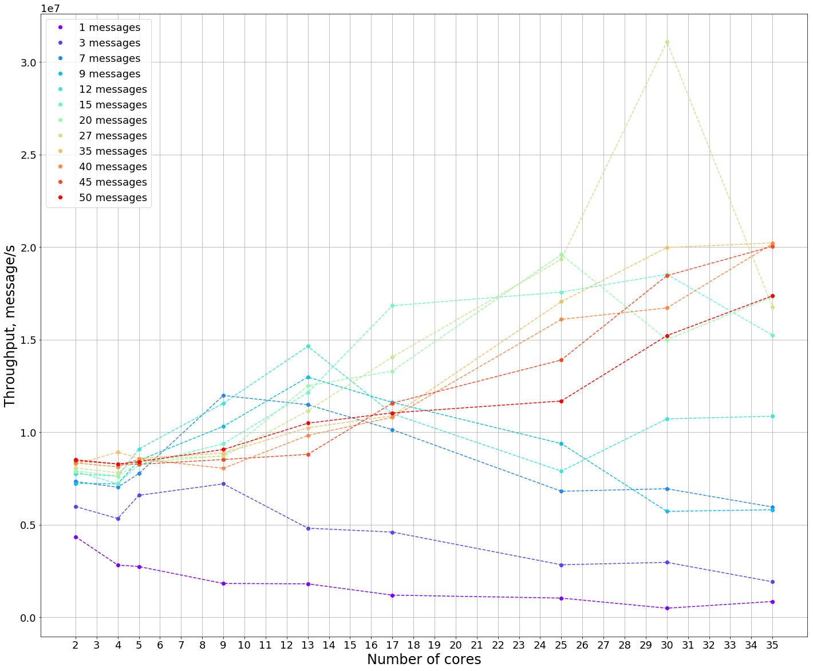

# Token Ring 
Simple realization of Token Ring protocol via concurrent local queues.
 
# Постановка задачи 
 Задача состоит в построении простой модели доисторического сетевого протокола сети под названием TokenRing и исследовании его свойств. 
 1. Система состоит из N пронумерованных от 0 до N-1 узлов (потоков). Узлы упорядочены по порядковому номеру. После состояния N-1 следует узел 0, т.е. узлы формируют кольцо. 
 2. Соседние в кольце потоки могут обмениваться пакетами. Обмен возможен только по часовой стрелке. 
 3. Каждый поток, получив пакет от предыдущего, отдает его следующему. 
 4. Пакеты не могут обгонять друг друга. 
 Исследуем пропускную способность сети (throughput) и характерное время задержки (latency)
  в зависимости от количества узлов N 
  и количества пакетов P (1...N), находящихся в системе одновременно. 
 Рассмортим возможности улучшения исследуемых характеристик и применимость 
 протокола для различных сценариев использования.
 
# Средства измерения
Для измерения всех временных интервалов использовалось стандартное ``` System.nanoTime() ``` 
поскольку предполагалось, что точности порядка мкс( 10<sup>-6</sup> секунд) будет достаточно для измерений. 
Минимальное время имеет погрешность, связанную с точностью измерения времени внутри JVM. 
[nanoTime()-JavaDoc](https://docs.oracle.com/javase/7/docs/api/java/lang/System.html#nanoTime())

# Рассчет latency
В качестве latency  будем использовать время прохода круга для специального сообщения с 
destinationID = 0 <br>(такой id невозможен для потоков, поскольку значение получаемое из getId() возвращает 
[положительное значение](https://docs.oracle.com/javase/6/docs/api/java/lang/Thread.html#getId()))</br>

# Рассчет throughput
Для анализа загруженности сети будем анализировать изменение того же показателя, (скорости обхода круга сообщением)
варьируя при этом количество сообщений в системе. Характерное увеличение времени обхода позволит
нам судить о переносимости системой нагрузок.

# Особенности измерений
В силу ограниченности физических ресурсов будем использовать следующие количества узлов - { 2, 4, 5, 9, 13, 17, 25 },
 а в качестве количества сообщений - { 1, 3, 7, 9, 12, 15, 20, 27, 35, 40 }. Выбор таких множеств входных
данных позволит оценить эффекты появляющиеся в следствии распараллеливания и повышения количества запросов, 
поступающих в систему.

# Анализ результатов измерений
## Latency


## Throughput




# Возможные оптимизации


# Инструментарий
"Обвязка" для исследования искомых характеристик (jupyter notebook)

```python
import subprocess
import numpy as np

summary = { "latency": [],
            "cores": [],
            "messages": []}

for cores in [2, 4, 5, 9, 13, 17, 25]:
    for messages in [1, 3, 7, 9, 12, 15, 20, 27, 35, 40]:
        proc = subprocess.Popen(["D:\\Program Files\\Java\\jdk1.8.0_91\\bin\\java", 
                        "-jar", "D:\\java_projects\\token\\target\\token-1.0-SNAPSHOT.jar", 
                        str(cores), str(messages)])
        try:
            proc.wait(20)
        except subprocess.TimeoutExpired:
            proc.terminate()

        log = open('D:\python_proj\log.txt', 'r+')

        nodes = {}
        log = log.readlines()
        for line in log[:-1]:
            node_name = line.split()[1]
            if node_name in nodes:
                nodes[node_name].append(line.split()[5])
            else:
                nodes[node_name] = [line.split()[5]] 

        print("Nodes: %d" % len(nodes.keys()))
        print("Messages: %d" % messages)
        average = []
        for key in nodes: 
            #plt.figure(figsize=(10,8))
            data = nodes[key]
            data = np.array(data).astype(np.long)
            average.append(np.mean(data))
            print("Mean:   %f" % np.mean(data))
            print("Median: %f" % np.median(data))
            #plt.plot(data)
            #plt.show()
        summary["latency"].append(np.mean(average))
        summary["messages"].append(messages)
    summary["cores"].append(cores)
    plt.figure(figsize=(10,8))
    plt.plot(summary["messages"], summary["latency"], "o", color=next(colors))
    plt.xlabel("Messages Cores: %d" % cores)
    plt.ylabel("Latency")
    plt.show()
    
plt.figure(figsize=(10,8))
plt.plot(summary["cores"], summary["latency"], "bo")
plt.show()
```
```python
import subprocess
import matplotlib
import numpy as np
import matplotlib.pyplot as plt
%matplotlib inline
#from threading import Timer

summary = { "latency": [],
            "cores": [],
            "messages": []}

colors = iter(['r', 'c', 'g', 'b', 'm','y'])

for cores in [2, 4, 5, 9, 13, 17, 25]:
    for messages in [1, 3, 7, 9, 12, 15, 20, 27, 35, 40]:
        proc = subprocess.Popen(["D:\\Program Files\\Java\\jdk1.8.0_91\\bin\\java", 
                        "-jar", "D:\\java_projects\\token\\target\\token-1.0-SNAPSHOT.jar", 
                        str(cores), str(messages)])
        try:
            proc.wait(20)
        except subprocess.TimeoutExpired:
            proc.terminate()

        log = open('D:\python_proj\log.txt', 'r+')

        nodes = {}
        log = log.readlines()
        for line in log[:-1]:
            node_name = line.split()[1]
            if node_name in nodes:
                nodes[node_name].append(line.split()[5])
            else:
                nodes[node_name] = [line.split()[5]] 

        print("Nodes: %d" % len(nodes.keys()))
        print("Messages: %d" % messages)
        average = []
        for key in nodes: 
            data = nodes[key]
            data = np.array(data).astype(np.long)
            average.append(np.mean(data))
            print("Mean:   %f" % np.mean(data))
            print("Median: %f" % np.median(data))
        summary["latency"].append(np.mean(average))
        summary["messages"].append(messages)
    summary["cores"].append(cores)
    
colors = iter(cm.rainbow(np.linspace(0, 1, 7)))

# Latency/Messages plot
plt.figure(figsize=(24,20))
start = 0
it = 0 
matplotlib.rcParams.update({'font.size': 18})
for i in range(10, len(summary["messages"]), 10):
    curr_color = next(colors)
    plt.plot(summary["messages"][start:i], summary["latency"][start:i], "o", color=curr_color, label=(str(summary['cores'][it]) + " nodes")) 
    plt.plot(summary["messages"][start:i], summary["latency"][start:i], '--',  color = curr_color )
    start += 10
    it += 1
plt.xticks(np.arange(min(summary["messages"]), max(summary["messages"])+1, 2.0))
plt.yticks(np.arange(min(summary["latency"]), max(summary["latency"])+1, 200.0))
plt.grid()
plt.legend()
plt.xlabel("Number of sent messages", fontsize=24)
plt.ylabel("One message full circle time, ns", fontsize=24)
plt.show()

# Latency/Cores plot
colors = iter(cm.rainbow(np.linspace(0, 1, 11)))

plt.figure(figsize=(24,20))
start = 0
it = 0 
matplotlib.rcParams.update({'font.size': 18})
# print(len(summary['messages'][:-10]))
for i in range( 10 ):
    curr_color = next(colors)
    plt.plot(summary['cores'][:-1], summary["latency"][i::10][:-1], "o", color=curr_color, label=(str(summary['messages'][i::10][0]) + " messages")) 
    plt.plot(summary['cores'][:-1], summary["latency"][i::10][:-1], '--',  color = curr_color )
plt.xticks(np.arange(min(summary["cores"]), max(summary["cores"])+1, 1.0))
plt.yticks(np.arange(min(summary["latency"]), max(summary["latency"])+1, 200.0))
plt.grid()
plt.legend()
plt.xlabel("Number of cores", fontsize=24)
plt.ylabel("One message full circle time, ns", fontsize=24)
plt.show()
```